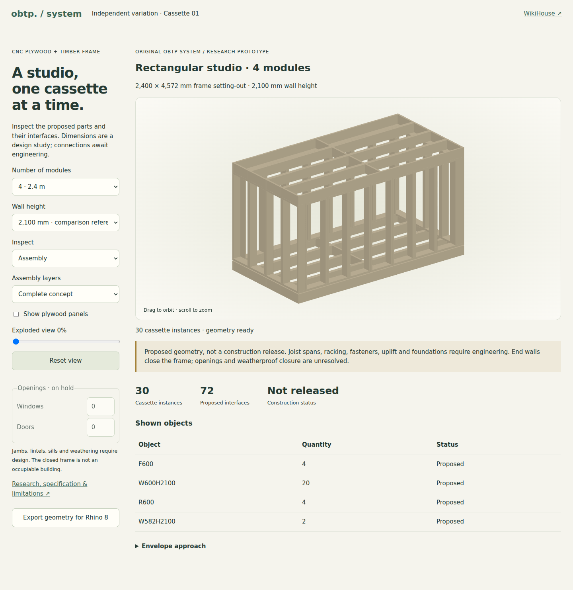

# OBTP Cassette 01 — research and decision record

23 September 2026 · independent system variation · **research prototype, not a construction release**

*Actual prototype screenshot. Panels hidden to inspect the frame; not a finished building.*

## Decision

Implement a timber-framed cassette system with CNC-cut plywood panels, mechanically connected boundary members and explicit interfaces between walls, floors and roofs. This is original OBTP nominal geometry, not renamed WikiHouse. WikiHouse remains a separate, pinned source-CAD variation; Studio v1 remains an unchanged reference inside Studio.

The selected concept preserves the existing 600 mm repetition and 4,572 mm setting-out width. The default wall height remains 2,100 mm for comparison. A separately labelled 2,700 mm study is available to investigate a habitable envelope; this is a design choice, not a claimed Lithuanian minimum height. Neither option is currently suitable for occupation: doors, windows, weatherproofing, ventilation, foundations and engineering remain incomplete.

## Research questions and acceptance criteria

1. Can a small, repeatable part family make a rectangular frame without depending on proprietary connector geometry or precision friction fits?
2. Which approach has useful evidence at the relevant material, connection and building scales?
3. Can CNC sheets be handled through an accessible service and assembled using saws, drills, clamps and ordinary measuring tools?
4. What prevents this geometry becoming a habitable Lithuanian studio?

Software acceptance: generate 1–8 modules; preserve the WikiHouse and v1 paths; provide floor/wall/roof stages, exploded view, orbit/reset, part quantities and connection inspection; keep System as the source; reject unsupported settings; verify positive-volume clashes, end-wall framing continuity and a connected interface graph. These checks do not verify load paths, fastener strength, erection stability, tolerances or moisture safety.

## Alternatives assessed

Ratings below are qualitative design judgements, not experimental measurements. The criteria are relevant evidence, DIY assembly, manufacturing accessibility, moisture robustness, repairability and rights clarity. No arbitrary numerical weighting is used.

| Approach | Evidence and advantages | Material drawbacks for this task | Decision |
|---|---|---|---|
| All-plywood slotted/interlocking frame | R4 provides direct material/joint experiments and numerical comparison; demountable geometry is attractive | Limited specimens and specific geometry; rotation, fit and moisture require new validation; no transferable studio capacity | Keep as a research alternative; do not reproduce its demonstrator |
| Timber frame with supported CNC plywood panels | R1 supplies established mechanical-fastener mechanics; R2 identifies the applicable European design framework; R3 demonstrates the need to study the assembled building | Requires connection design, duplicated boundary studs and thermal-bridge treatment; less all-plywood purity | **Selected for the first digital implementation** |
| Glued stressed-skin cassette | Potential material efficiency through composite action; relevant adhesives literature exists | Bond-line preparation, curing, quality assurance and moisture durability are poor assumptions for first-time DIY assembly | Deferred; no composite stiffness or glue capacity assumed |

Traditional housed, lap and mortise-and-tenon principles were considered as mechanical bearing/registration ideas. They are not evidence for the capacity of thin plywood slots, nor does a traditional principle remove rights attached to a modern drawing or patented product. This release uses plain bearing and mechanically restrained interfaces; it does not invent an interlocking load-bearing joint.

## Evidence register and review limits

**R1 — Rammer, D.R. (2021), “Fastenings”, Chapter 8 of Wood Handbook—Wood as an Engineering Material, FPL–GTR–282.** [USDA Forest Products Laboratory PDF](https://research.fs.usda.gov/download/treesearch/62253.pdf). Read chapter introduction and selected fastener sections, particularly wood screws, pp. 8-10 onward. Technical synthesis grounded in experiments; it distinguishes ultimate tests from design resistance and describes material, grain, penetration and moisture dependencies. It supports the connection *principle*, not our dimensions or a fastening schedule. Its US design context cannot substitute for Lithuanian Eurocode design. Government-hosted text is linked, not republished; embedded third-party rights have not been exhaustively checked.

**R2 — European Commission JRC, Eurocode 5 overview.** [Official scope](https://eurocodes.jrc.ec.europa.eu/EN-Eurocodes/eurocode-5-design-timber-structures). Official overview reviewed, not the complete paid standards. EN 1995 covers timber and wood-based panels with mechanical or adhesive joints, in conjunction with EN 1990, EN 1991 and relevant product assessments. A Lithuanian engineer must establish currently adopted editions, national annexes, actions, service classes and fire requirements. No standard tables or normative text are copied.

**R3 — Miedziałowski et al. (2023), “Stiffness of Experimentally Tested Horizontally Loaded Walls and Timber-Framed Modular Building”, Materials 16(18), 6229.** [DOI 10.3390/ma16186229](https://doi.org/10.3390/ma16186229); [author article in PMC](https://pmc.ncbi.nlm.nih.gov/articles/PMC10532801/). Updated 24 September 2026: full textual methods, results and discussion subsequently retrieved through Europe PMC and reviewed. See [the detailed connection review](CONNECTIONS.md#c2--panel-scale-versus-building-scale-experiments) for the adhesive confound, test end-point, transfer limits and licence. The earlier partial-access limitation no longer applies to this article; no OBTP capacity is inferred.

**R4 — Aranha, C.A., Hudert, M. & Fink, G. (2021), “Interlocking birch plywood structures”, International Journal of Space Structures 36(3), 155–163.** [DOI/full text](https://journals.sagepub.com/doi/10.1177/09560599211022219). Methods, specimen table, FE limitations, fabrication/assembly discussion, conclusions and rights reviewed. Specific birch plywood specimens from an exhibition structure were conditioned; small specimen numbers and selected angles limit generalisation. Tests identify low longitudinal rotational stiffness/capacity; a linear elastic FE comparison does not validate plastic failure or long-term weather exposure. Tight cuts complicated assembly. Article CC BY 4.0; geometry not copied. This is evidence against assuming a precise slot alone gives reliable structural performance, not evidence that all interlocks are unsuitable.

**R5 — Viljanen, K. (2023), Hygrothermal performance of wood-framed, mineral-wool-insulated walls and roofs with low thermal transmittance, Aalto doctoral thesis.** [University abstract and bibliographic record](https://research.aalto.fi/en/publications/hygrothermal-performance-of-wood-framed-mineral-wool-insulated-wa/). **Abstract only reviewed**, not all 262 pages. Reports experiments addressing rain leakage, built-in moisture and exfiltration, alongside analysis. Supports investigating airtightness and exterior insulation rather than diffusion alone. Finnish highly insulated assemblies are relevant cold-climate evidence but not direct validation of Lithuanian conditions or our plywood placement. Numeric recommendations are not imported into our specification. Link only; republication rights not established.

**R6 — Borodinecs et al. (2025), “Hygrothermal performance of well-insulated wood-frame walls in Baltic climatic conditions”, Case Studies in Thermal Engineering 66, 105772.** [DOI](https://doi.org/10.1016/j.csite.2025.105772); [University of Latvia record](https://research.lu.lv/en/publications/hygrothermal-performance-of-well-insulated-wood-frame-walls-in-ba/). **Abstract only reviewed**. Climate-chamber experiments plus DELPHIN simulations compare materials and vapour-control strategies. Reported benefits for bio-based insulation are a counterpoint to choosing mineral wool by default. Boundary conditions and uncertainty were not fully accessible, so neither reported percentages nor barrier ratios are adopted. Article reuse licence not verified; link only.

**R7 — ROCKWOOL Lithuania, SUPERROCK technical data sheet.** [Official PDF](https://www.rockwool.com/siteassets/rw-lt/5.0-support/dokumentai/technin-specifikacija/superrock_lt_datasheet.pdf). One-page sheet reviewed. It lists non-loadbearing frame-cavity applications, declared conductivity 0.035 W/(m·K), and nominal 565/610 mm widths. This establishes a locally documented product category, not stock, pricing, system approval or a whole-wall U-value. Our 510 mm standard cassette cavity requires cutting; 195 mm cavity depth must not be filled by blindly compressing a 200 mm batt. Product selection remains open. Manufacturer copyright; no drawing reproduced.

**R8 — CNCfrezavimas.lt, workshop capabilities.** [Provider page](https://cnc-frezavimas.lt/apie-mus). Page reviewed as a supplementary market lead: advertises plywood cutting, 1,250 × 2,500 mm working area and individual orders. Not independently audited; no contact, quote or purchase made. Our nominal panel envelope uses the smaller 1,220 × 2,440 mm planning sheet, allowing an ordinary CNC service route. Actual stock, cutter access, hold-down, edge trim and machining allowance require supplier confirmation. Link only; no copied designs.

**R9 — Lithuanian Ministry of Environment, 27 November 2020 announcement on A++ new buildings.** [Official announcement](https://am.lrv.lt/lt/naujienos/naujai-statomu-namu-energinis-naudingumas-jau-tik-a-klases). Historical official notice reviewed as context, not proof of current applicability. Current building-use classification, size exceptions, permit rules and energy requirements must be checked against consolidated legislation for the actual site. [Residential regulation record](https://e-seimas.lrs.lt/portal/legalAct/lt/TAD/TAIS.226882/asr) and [SSVA energy-certification guidance](https://www.ssva.lt/cms/dazniausiai-uzduodami-klausimai/pastatu-energinio-naudingumo-sertifikavimas) are starting points. No blanket “under 50 m²” exemption or A++ compliance is claimed.

**R10 — Timberwalls / UAB Gelmeda, Pre-Cut service.** [Official page](https://timberwalls.net/lt/produktai/pre-cut/). Current page reviewed, following the earlier project provider screen. It advertises labelled C24 timber members and assembly drawings. This is supplementary evidence for a Lithuanian pre-cut supply route, not proof of willingness to supply our small cassettes or approval of their dimensions. Manufacturer precision and crane-free claims are not adopted. No supplier contacted and no proprietary geometry copied.

Additional leads were screened but not used to justify dimensions: Sim[PLY] (publisher unavailable); full-scale light-frame modules DOI 10.1016/j.engstruct.2024.117617 (publisher unavailable); and weathered sheathing connections DOI 10.3390/f14040734 (publisher rate-limited). Their titles/snippets are not treated as full reviews.

## Evidence synthesis and unresolved disagreement

The evidence is strongest for established timber/fastener mechanics and the need to test whole assemblies. It is weaker for this particular modular arrangement, which has never been tested. Neither attractive slot geometry nor a successful frame demonstration establishes a habitable kit.

R5 and R6 caution against a universal envelope recipe: air leakage, exterior insulation, material buffering and vapour resistance interact. We select mineral wool provisionally for the user's preference and local documented availability, while retaining wood fibre as a credible comparison in the next hygrothermal study. We do not infer that a vapour-open material allows omitting a continuous airtight layer.

The new UI therefore exposes geometry and interfaces but intentionally exports no capacities, screw schedules, installation tolerances or fabrication-ready holes. The floor and roof joist sections are placeholders; their 4,572 mm span has not been checked. Engineered joists, an intermediate support or revised depths may be required. A flat roof deck in this comparison model is not a drainage solution.

## Reuse and ownership

New cassette geometry and text are original OBTP proposals; no additional public reuse licence is assigned by this task. Public repository readability does not grant an additional reuse licence; confirm the owner's preferred licence before wider licensed distribution. Third-party papers remain under their own licences. WikiHouse CAD, meshes and notices retain their existing CC BY-SA 4.0 obligations and provenance. The shared browser renderer is OBTP application code; using it does not mix WikiHouse part geometry into Cassette 01. Patent/freedom-to-operate clearance has not been performed. No branded connector is cloned.

## Next validation gates

1. Site/use brief and Lithuanian engineer: actions, snow/wind, supports, deflection/vibration, stability, diaphragm transfer, uplift, fire, accessibility and egress.
2. Select graded timber, structural plywood declaration and fastener/connector products; design each interface and obtain a reviewed fastening schedule. Check installation access before closing panels.
3. Measure stock and machine coupons; establish panel gaps and fit allowances empirically. Prototype one floor/wall/roof corner plus an adjacent seam, including reversible assembly and realistic moisture conditioning.
4. Test sheathing joints, racking and floor/roof behaviour under an engineer's protocol; correlate any calculation/FE model with measurements.
5. Run transient hygrothermal analysis with Lithuanian weather, construction moisture, occupancy and air-leakage sensitivity; calculate repeating/linear thermal bridges and whole-envelope heat loss. Review roof and ground details separately.
6. Design openings, weather seals, fire linings and ventilation; validate water management and airtightness on the prototype. Only then consider a fabrication release.

## Connection research follow-up — 24 September 2026
See [CONNECTIONS.md](CONNECTIONS.md) for the selected sections now reviewed from Swedish Wood Volume 2, primary product-document candidates, six interface families, the 45 mm hold-down fit issue and narrow-panel height screening. The review updates evidence and design holds without releasing hardware or changing nominal geometry.

## Paper-led alternatives follow-up

[CONNECTION_ALTERNATIVES.md](CONNECTION_ALTERNATIVES.md) adds six research sources and seven original mechanism studies. The existing product candidates, measured probes and failed distance checks remain authoritative for those tested geometric positions. Alternative plate envelopes are not assessed hardware or proof of a resolved connection.
